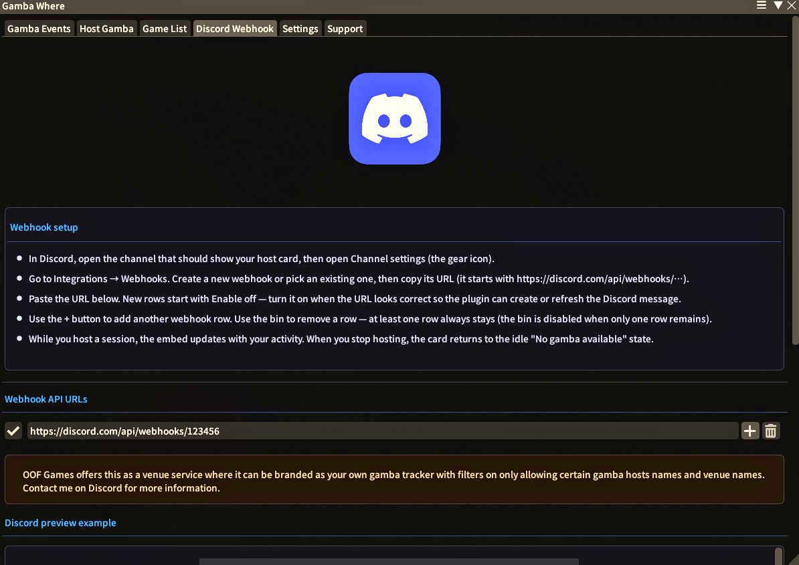

# Gamba Where

Find and host FFXIV gambling events near you.

`Gamba Where` is a Dalamud plugin that lets players discover active gamba sessions and host their own with configurable rules, presets, and automatic location updates.

## What It Does

- **Browse active events** in a card-based feed with host name, venue, description, rules, location, and Discord copy helper.
- **Filter quickly** by game type and data centre from the main events list.
- **Host your own session** for Bingo, Blackjack, Chocobo Racing, Mini Games and much more!
- **Save and reuse presets** per game type (add, rename, update, delete).
- **Auto-maintain your listing** with a background location/auto rules refresh every 1 minute while your session is active.
- **Auto-detect rules** from companion plugins such as SimpleBingo, Simple Roulette, and Chocobo Racing Gamba, with clickable chat prompts where supported.
- **Lifestream integration** (optional): one click takes you straight to the gamba. The Lifestream plugin is required for this feature.
- **Game list**: find information on plugins that can help you host certain games.
- **Support tab**: FAQ answers and a Discord link if you need help with this plugin.

## Commands

- `/gambawhere` - Open the main plugin window.
- `/gw` - Alias for `/gambawhere`.
- `/gambawhereconfig` - Open directly to the settings tab.

## Interface

### Gamba Events Tab

Discover active gambling events, refresh data from the API, apply filters, and expand cards to inspect full rule and location details.

### Host Gamba Tab

Create and manage sessions with venue selection, game-specific rule controls, preset management, description input, and start/stop controls.

### Discord Webhook Tab

Configure Discord webhooks for your session announcements from the plugin window.

### Game List

Browse plugins that pair with hosting: see what each one does and how it fits your events.

### Support Tab

Read common questions and follow the Discord link for support specific to Gamba Where.

## How to Install Gamba Where

1. Type `/xlsettings` in the in-game chat.
2. Go to the Experimental tab.
3. Paste this link into the **Custom Plugin Repositories** at the bottom:

   `https://raw.githubusercontent.com/OOFGamesss/OOFGamesPlugins/main/pluginmaster.json`

4. Click the `+` button, ensure it is **Enabled**, and click **Save and Close**.
5. Type `/xlplugins`, search for "Gamba Where", and click **Install**.

## Want to add your venue to Gamba Where?

Join the [OOFGames Discord](https://discord.gg/vM6ff4h5Ym) and we'll get you set up!
