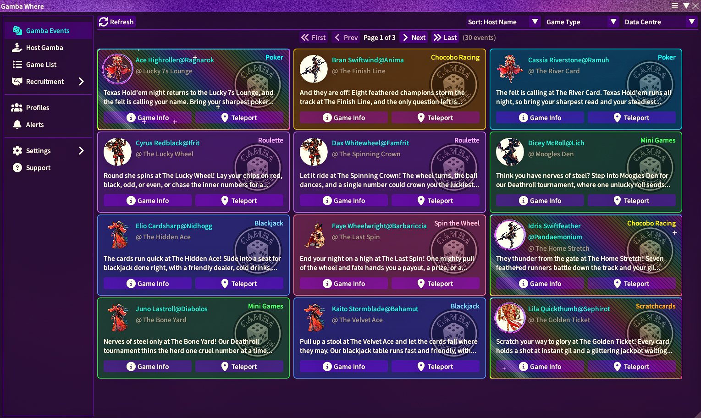
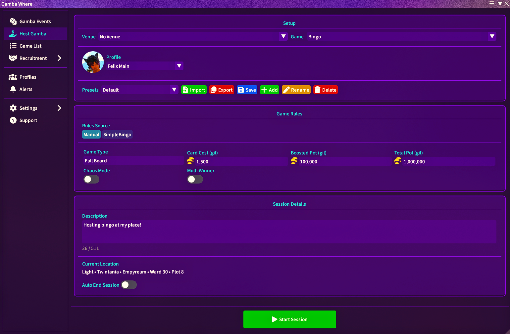
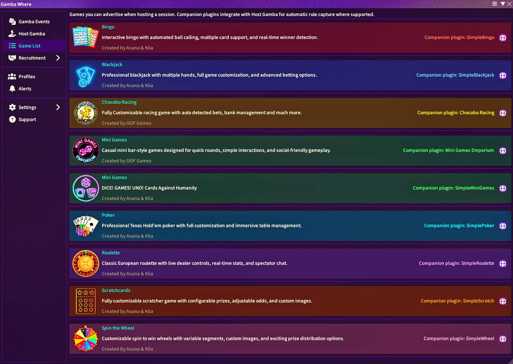
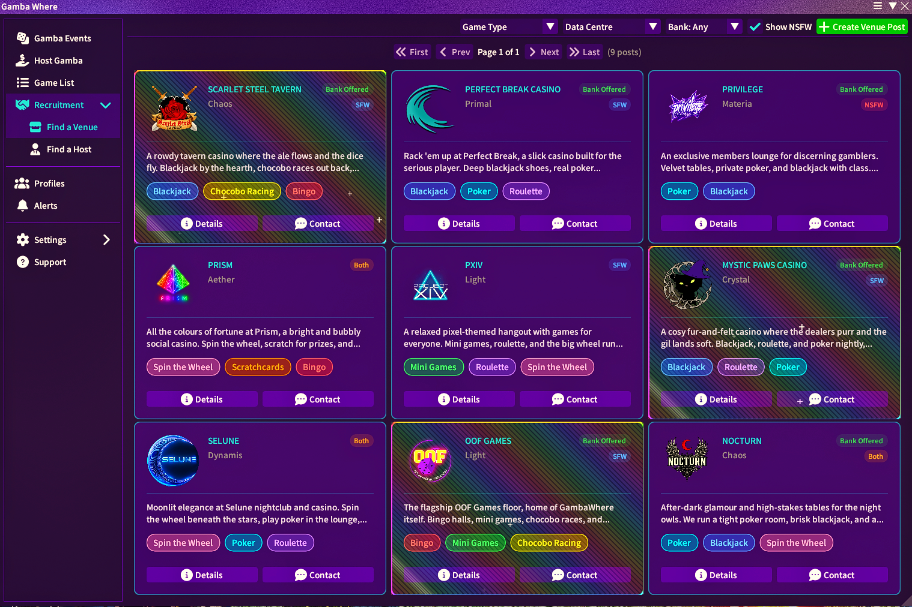
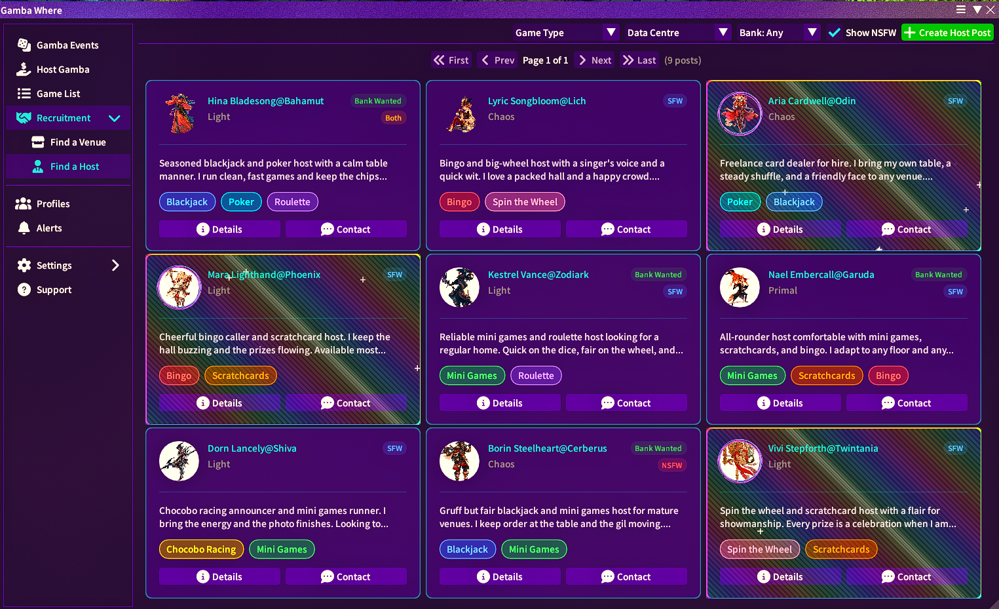
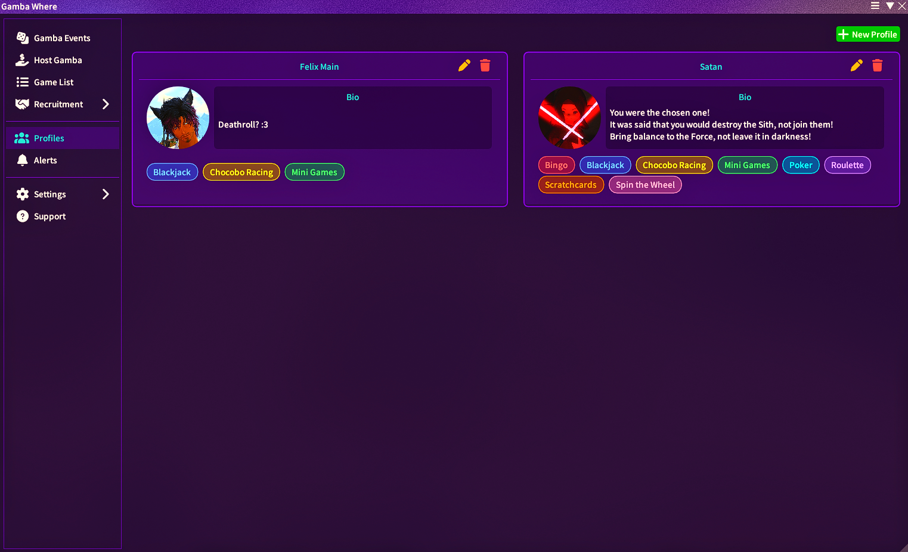
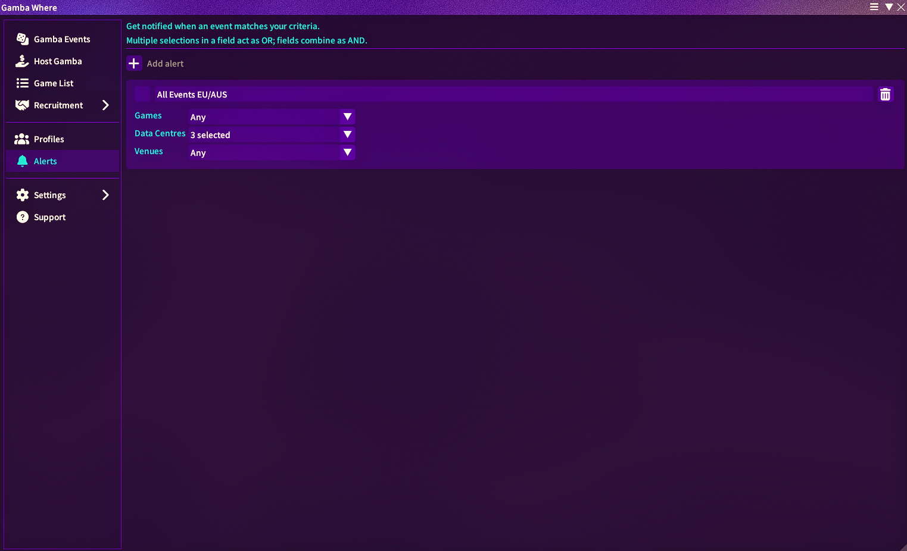
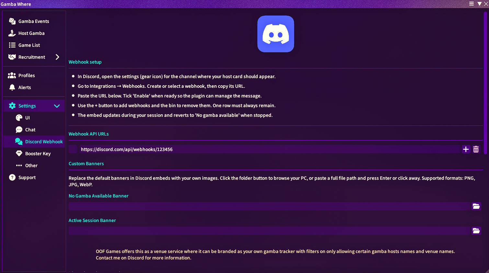

# Gamba Where

Find and host FFXIV gambling events near you.

`Gamba Where` is a Dalamud plugin that lets players discover active gamba sessions and host their own with configurable rules, presets, and automatic location updates.

## What It Does

- **Browse active events** in a card-based feed with host name, venue, description, rules, location, and Discord copy helper.
- **Filter quickly** by game type and data centre from the main events list.
- **Host your own session** for Bingo, Blackjack, Chocobo Racing, Mini Games, Poker, Roulette, Scratchcards, and Spin the Wheel.
- **Save and reuse presets** per game type (add, rename, update, delete).
- **Build host profiles** with a name, bio, avatar image, and the games you run, then attach them to your hosted events.
- **Recruit and be recruited** through the Recruitment board: venues can advertise for hosts and hosts can advertise for venues.
- **Auto-maintain your listing** with a background location and automatic rules refresh every minute while your session is active.
- **Auto-detect rules** from companion plugins such as Simple Bingo, Simple Roulette, Chocobo Racing, and Mini Games Emporium, with clickable chat prompts where supported.
- **Announce on Discord** via configurable webhooks, including a session snapshot embed and optional banner image.
- **See your session at a glance** with the floating session pill overlay.
- **Spot hosts on your minimap** with colour-coded dice icons for nearby active hosts in your current area, with a hover tooltip showing the host, game, and rules. Each game type has its own colour, and you can toggle the markers and per-game visibility from **Settings -> UI**.
- **Create a Party Finder listing** for your active session in one click. **Create Party** and **Create Alliance** pre-fill the native Party Finder recruitment window with your game, venue, and current location ready for you to register manually.
- **Find a host in the Party Finder** straight from an event card. The **Find in PF** button locates the host's live listing and opens it so you can join (available when the event is on your current data centre).
- **Lifestream integration** (optional): one click takes you straight to the gamba. The Lifestream plugin is required for this feature.
- **Game list**: find information on plugins that can help you host certain games.
- **Support tab**: FAQ answers and a Discord link if you need help with this plugin.
- **Alerts**: get an in-game chat line (and optional toast or sound) when a new event matches data centres, games, or venues you choose.
- **Booster perks**: Discord server boosters can unlock a holographic profile treatment with a booster key.

## Commands

- `/gambawhere` - Open the main plugin window.
- `/gw` - Alias for `/gambawhere`.
- `/gambawhereconfig` - Open directly to the settings tab.

## Interface

### Gamba Events Tab

Discover active gambling events, refresh data from the API, apply filters, and expand cards to inspect full rule and location details. Each card has a **Find in PF** button that locates the host's live Party Finder listing and opens it so you can join, available when the event is on your current data centre.

### Host Gamba Tab

Create and manage sessions with venue selection, game-specific rule controls, preset management, description input, and start/stop controls.

While a session is active, use **Create Party in Partyfinder** or **Create Alliance in Partyfinder** to open the native Party Finder recruitment window pre-filled with your game, venue, and current location. You then review and click Recruit Members yourself; nothing is registered automatically.

### Game List

Browse plugins that pair with hosting: see what each one does and how it fits your events.

### Recruitment

Expand **Recruitment** in the sidebar to reach **Find a Venue** and **Find a Host**.

- **Find a Venue**: hosts browse and post listings looking for a venue to run at.
- **Find a Host**: venues browse and post listings looking for a host.

### Profiles Tab

Create, edit, and delete local host profiles. Each profile carries a name, a bio, an avatar image, and the games you run, and can be attached to the events you host.

### Alerts Tab

Set up in-game chat alerts for specific **data centres**, **games**, or **venues** from this tab.

Click **+ Add alert**, name the rule, then use the three multi-select rows:

- **Games**, **Data Centres**, **Venues**: leave a row on **Any** if you do not want to filter on that axis.
- Within one row, choosing several values means "match any of these". Across rows, filters combine with AND (for example Chaos under Data Centres and Blackjack under Games both apply).

Each rule needs at least one concrete choice somewhere; an alert with only **Any** everywhere will not fire.

After the first events refresh, matching sessions produce a coloured chat line tagged **GambaWhere** with game, venue or location, and host. Click that line to open **Gamba Events** with the relevant card expanded. Optional quest toasts and chat sound effects are on the **Settings** tab.

### Settings

Manage the plugin from the **Settings** sidebar group, split into **UI**, **Chat**, **Discord Webhook**, **Booster Key**, and **Other**.

#### UI

Under **UI** you can toggle **Minimap Host Icons** on or off, and choose which game types show a dice marker on your minimap. Each game's marker uses its own colour, shown next to its name.

#### Discord Webhook

Configure Discord webhooks for your session announcements from **Settings -> Discord Webhook** in the plugin window.

#### Booster Key

Redeem a booster key under **Settings -> Booster Key** to unlock the holographic profile treatment for Discord server boosters.

### Support Tab

Read common questions and follow the Discord link for support specific to Gamba Where.

## How to Install Gamba Where

1. Type `/xlsettings` in the in-game chat.
2. Go to the Experimental tab.
3. Paste this link into the **Custom Plugin Repositories** at the bottom:

   `https://puni.sh/api/repository/oof-games`

4. Click the `+` button, ensure it is **Enabled**, and click **Save and Close**.
5. Type `/xlplugins`, search for "Gamba Where", and click **Install**.

## Want to add your venue to Gamba Where?

Join the [OOFGames Discord](https://discord.gg/vM6ff4h5Ym) and we'll get you set up!
